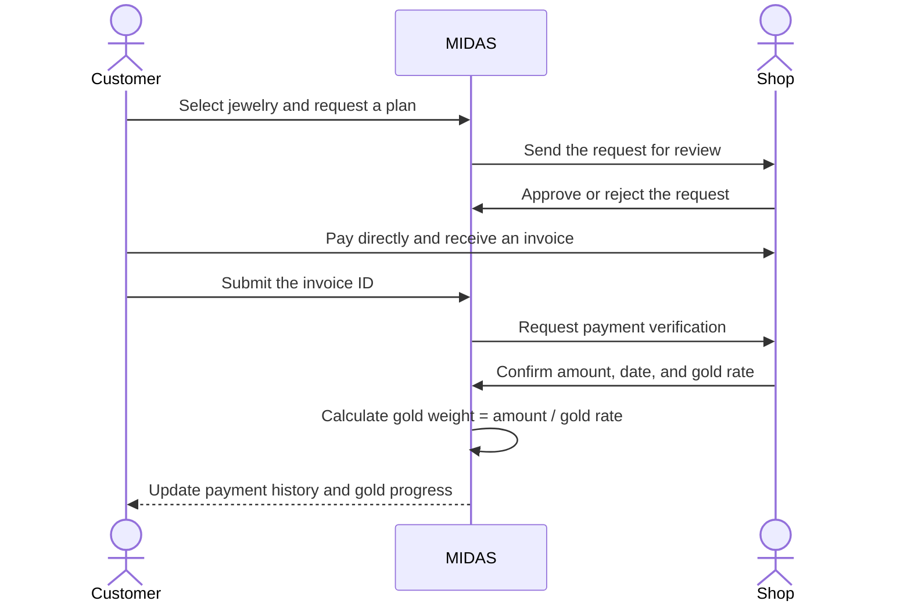
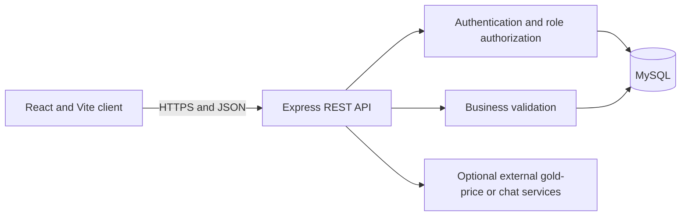

# MIDAS

<p align="center">
  
</p>

<p align="center">
  <strong>A jewelry marketplace and transparent digital gold installment ledger built for Bangladesh.</strong>
</p>

<p align="center">
  <a href="#the-problem">The problem</a> ·
  <a href="#how-midas-works">How it works</a> ·
  <a href="#role-based-experience">User roles</a> ·
  <a href="#run-the-project-locally">Local setup</a> ·
  <a href="#security-and-trust-boundaries">Security</a>
</p>

MIDAS brings customers, jewelry shops, and platform administrators into one traceable workflow.
Customers can discover jewelry, request an installment agreement, pay the selected shop directly,
and submit an invoice for verification. The shop confirms the payment details, and MIDAS converts
the confirmed amount into recorded gold weight using the shop-supplied gold rate.

MIDAS is intentionally **noncustodial**: it records marketplace and agreement activity, but it does
not receive, hold, transfer, guarantee, or refund money or gold.

> [!NOTE]
> This repository contains the React frontend. It runs with the separate `MidasBackend` Express and
> MySQL workspace described in the setup section.

## The problem

Jewelry installment purchases often involve information spread across shop invoices, verbal
agreements, and personal calculations. That makes it difficult for customers to understand their
progress and for shops to manage requests consistently.

MIDAS provides a shared record where:

- Customers can see what they requested, which payments were verified, and how much gold has been
  accumulated.
- Shops remain responsible for accepting agreements and confirming money received at the shop.
- Administrators can verify partner shops and inspect platform-level records.
- Submitted payment claims and shop-confirmed payments remain visibly distinct.

## How MIDAS works



Only an approved payment record advances the customer's installment progress. The API recalculates
gold weight from the confirmed amount and rate instead of trusting a value supplied by the browser.

### Example

If a shop confirms a payment of `৳25,000` at a rate of `৳12,500 per gram`, MIDAS records:

```text
25,000 ÷ 12,500 = 2.000 grams of gold
```

This represents a ledger entry, not gold held by MIDAS.

## Role-based experience

### Customer workspace

- Register and complete mandatory Area and NID onboarding.
- Browse shop-uploaded jewelry and verified partner shops.
- Request direct-purchase or installment arrangements.
- Track agreement status, payment history, and accumulated gold.
- Apply for a payment record using an invoice ID after paying the shop.
- Receive approval, rejection, and activity notifications.
- Publish and browse customer-to-customer jewelry listings.

### Partner-shop workspace

- Submit trade, tax, contact, and business information for verification.
- Keep verified identity details protected from later editing.
- Publish products with price, purity, weight, images, and stock status.
- Review customer purchase and installment requests.
- Approve or reject invoice-based payment applications.
- Record confirmed amount, payment date, gold rate, and rate source.
- Monitor customers, agreements, inventory, and operational insights.

### Administrator workspace

- Review registered customers and partner shops.
- Approve or reject shop-verification applications.
- Inspect products, agreements, payments, and platform reports.
- Monitor record integrity and manage platform settings.

### Public experience

- Explore the landing page, marketplace, partner shops, help, and legal information.
- Switch between English and Bangla.
- Review the platform model before creating an account.

## Core capabilities

| Area              | Implementation                                                                |
| ----------------- | ----------------------------------------------------------------------------- |
| Authentication    | JWT sessions, bcrypt password hashes, current-session restoration             |
| Authorization     | Customer, shop, and administrator route/API separation                        |
| Marketplace       | API-driven catalog, search, categories, product details, shop inventory       |
| Installments      | Request, review, agreement, payment submission, and gold-progress lifecycle   |
| Shop verification | Administrator-reviewed partner profiles and protected verified details        |
| Notifications     | Role-aware activity and decision updates                                      |
| Localization      | Persistent English and Bangla interface selection                             |
| Reporting         | Customer activity, shop operations, and administrator summaries               |
| C2C listings      | Customer-managed jewelry resale listings with explicit marketplace boundaries |

## System architecture



The backend is the authority for identity, roles, shop verification, agreement state, and payment
records. MySQL is the system of record. The browser stores only the access token and non-sensitive
interface preferences.

### Main API groups

| Endpoint group             | Responsibility                                        |
| -------------------------- | ----------------------------------------------------- |
| `/api/auth`                | Registration, login, and current session              |
| `/api/users`               | Account profile and administrator user records        |
| `/api/shops`               | Public partner list, shop profiles, and verification  |
| `/api/products`            | Marketplace catalog and shop inventory                |
| `/api/plans`               | Purchase requests and installment agreement lifecycle |
| `/api/payments`            | Shop-confirmed payments and gold conversion           |
| `/api/payment-submissions` | Customer invoice applications and shop decisions      |
| `/api/c2c`                 | Customer-to-customer listings                         |
| `/api/notifications`       | Account activity notifications                        |
| `/api/admin/reports`       | Aggregated platform metrics                           |

## Technology stack

| Layer               | Technology                                        |
| ------------------- | ------------------------------------------------- |
| Frontend            | React, Vite, JavaScript, CSS                      |
| Backend             | Node.js, Express                                  |
| Database            | MySQL with parameterized queries                  |
| Authentication      | JSON Web Tokens and bcrypt                        |
| Testing and quality | Node test runner, Prettier, Vite production build |

## Run the project locally

### Prerequisites

- Node.js 20 or newer
- npm
- MySQL 8, MariaDB, or a compatible XAMPP MySQL installation
- The `MidasBackend` workspace alongside this frontend directory

Recommended local layout:

```text
work/
├── Midas-main/       React frontend
└── MidasBackend/     Express API and MySQL schema
```

### 1. Start MySQL

Start MySQL from XAMPP or your local database service. The backend migration command creates the
required tables in the configured database.

### 2. Configure and start the backend

```sh
cd ../MidasBackend
cp .env.example .env
npm install
npm run migrate
npm run seed
npm run dev
```

Set a unique `JWT_SECRET` of at least 32 characters and update the database credentials in `.env`.
The API listens on `http://localhost:4000` by default.

### 3. Configure and start the frontend

```sh
cd ../Midas-main
cp .env.example .env
npm install
npm run dev
```

Open the local URL printed by Vite. The default configuration sends API requests to
`http://localhost:4000/api`.

### Frontend environment variables

| Variable                  | Required | Description                                                |
| ------------------------- | -------- | ---------------------------------------------------------- |
| `VITE_API_URL`            | Yes      | MIDAS REST API base URL, including `/api`                  |
| `VITE_METALPRICE_API_KEY` | No       | Optional market-data provider key for gold-price estimates |
| `VITE_MIDAS_CHAT_API_URL` | No       | Optional external chatbot endpoint                         |

> [!WARNING]
> Every `VITE_` value is bundled into browser code. Never place database passwords, JWT secrets, or
> other private server credentials in the frontend environment.

## Demo data

`npm run seed` in the backend creates local customer, shop, and administrator accounts, sample
products, agreements, and payment data. The seed script prints the shared development password.

Seed data exists only to demonstrate each role. Do not run it in a real production database, and do
not deploy any seeded credentials.

## Useful commands

| Command           | Purpose                                                  |
| ----------------- | -------------------------------------------------------- |
| `npm run dev`     | Start the frontend development server                    |
| `npm run build`   | Create an optimized production bundle in `dist/`         |
| `npm run preview` | Preview the generated production bundle                  |
| `npm test`        | Run automated frontend tests                             |
| `npm run format`  | Format supported files with Prettier                     |
| `npm run check`   | Run tests, formatting validation, and a production build |

## Project structure

```text
src/
├── components/    Reusable UI, marketplace, installment, and dashboard components
├── context/       Authentication and toast state
├── data/          Static presentation data
├── hooks/         API resources, authentication, products, plans, and shared state
├── layouts/       Public and role-specific application shells
├── pages/         Public, customer, shop, administrator, and authentication screens
├── routes/        Route definitions and protected-route handling
├── services/      MIDAS API client and optional external-service integrations
├── types/         Shared model definitions
└── utils/         Formatting, icons, and general helpers
```

## Security and trust boundaries

- Payments occur directly between a customer and a shop; MIDAS never processes them.
- Customer-submitted invoices remain pending until the relevant verified shop decides them.
- Gold weight is calculated by the backend from the confirmed amount and rate.
- Protected API routes require a signed bearer token and the correct role.
- Verified shops cannot silently replace important identity and business details.
- Passwords are stored as bcrypt hashes, not plaintext.
- Database operations use parameterized queries.
- Real NIDs, invoices, access tokens, database exports, and verification documents must never be
  committed to Git.

See [SECURITY.md](SECURITY.md) for private vulnerability-reporting guidance.

## Current status and limitations

MIDAS is an active, pre-deployment project. The core multi-role workflow is implemented locally,
but a production launch still requires infrastructure and operational work, including:

- TLS, a production reverse proxy, and strict allowed origins.
- Managed database backups and least-privileged database credentials.
- Private object storage for product images and verification documents.
- Secret management, rate limiting, monitoring, and audit retention.
- Independent security, privacy, accessibility, and legal review.
- Replacement of all local seed accounts and credentials.

The project must not be treated as a bank, wallet, payment processor, gold custodian, or guarantee
of a transaction between users.

## Contributing

Focused contributions are welcome. Please read [CONTRIBUTING.md](CONTRIBUTING.md) and
[CODE_OF_CONDUCT.md](CODE_OF_CONDUCT.md), then run the full check before opening a pull request:

```sh
npm run check
```

Backend changes should also pass `npm run check` from `MidasBackend`.

## About the developer

MIDAS is designed and maintained by [Arman-zz](https://github.com/Arman-zz).

## License

No open-source license has been declared. Unless a license is added, all rights are reserved and
reuse requires the repository owner's permission.
